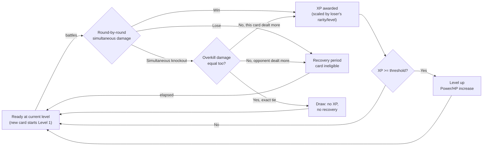

# Battle System

## Problem Frame

TzDeck currently treats OBJKT cards as static collectibles: pull them from packs, view them in My Deck, optionally wishlist them. Once a card is collected there's no ongoing reason to revisit it, and no feature makes use of the real market data (price, edition size, rarity) beyond the one-time grading label already shown on the About page.

The site is explicitly inspired by [wikigacha.com](https://wikigacha.com), which layers an automated battle system on top of its card data (ATK from page views, DEF from article length, both multiplied by rarity) to give collected cards an ongoing purpose. This brainstorm defines an analogous system for TzDeck: a wallet's held OBJKTs gain Level/Power/HP through PvP battles against other connected wallets' cards, turning static rarity data into a persistent strategy meta-game — without compromising the site's stated "purely a discovery layer" positioning (no wagering, no effect on real OBJKT ownership or listed price).

---

## Actors

- A1. Attacker: the connected wallet initiating a battle — selects an eligible card from My Deck, proves control of that wallet via a signed challenge, and starts a battle via random matchmaking or by challenging a specific wallet.
- A2. Defender: a wallet that has explicitly opted into the battle pool — one of its eligible cards, whichever has the closest combined Power×HP product to the searching attacker's, is battled against, regardless of whether that wallet is online at the time (see Key Decisions). Wallets that have never opted in, or that have since opted out, cannot be matched or directly challenged. A wallet's own address is never eligible to defend against its own attack.
- A3. Server: the battle authority — verifies the attacker's signed session, verifies both cards' current on-chain ownership, runs the damage-exchange simulation, and persists XP, level, and recovery state atomically for both cards.

---

## Key Flows

- F1. Random Battle
  - **Trigger:** Attacker selects an eligible (not-recovering) card from My Deck and starts a random battle.
  - **Actors:** A1, A2, A3
  - **Steps:** Attacker picks a card and authenticates the request via a signed challenge → server verifies the attacker currently holds that card → server reduces the opt-in battle pool (excluding the attacker's own wallet, and excluding wallets/cards that are recovering or over their defense cap) to one candidate per wallet — whichever of that wallet's eligible cards has the closest combined Power×HP product to the attacker's card, not necessarily that wallet's strongest card — then selects among wallets with a fitting candidate within the current band on that product, progressively widening the band up to a bound → if no candidate is found even at the widest band, the search fails with "No eligible opponent available" and consumes no battle allowance (though the search itself still costs server/database work — see Dependencies) → otherwise, server re-verifies the defender's card is still held by that wallet, re-rolling a different opponent if not → server runs the damage-exchange simulation using both cards' current Power/HP → server persists the result atomically: winner's card gains XP scaled by the loser's rarity/level and may level up, loser's card enters recovery, or — on a true draw (an exact-numeric overkill coincidence on a simultaneous knockout, R14) — neither side gains XP nor enters recovery → result shown to the attacker.
  - **Outcome:** Battle outcome and any level-up are recorded against both wallets; the losing card (if any) is temporarily ineligible for further battles. A failed search costs the attacker no battle allowance.
  - **Covered by:** R2, R3, R4, R5, R6, R10, R13, R14, R15, R17, R18, R20

- F2. Challenge a Specific Wallet
  - **Trigger:** Attacker targets a specific opponent wallet address instead of random matchmaking.
  - **Actors:** A1, A2, A3
  - **Steps:** Attacker enters or selects an opponent wallet, which must differ from the attacker's own wallet → server rejects the challenge outright if that wallet hasn't opted into the battle pool (or has since opted out) or is currently over its defense cap → otherwise selects whichever of that wallet's eligible cards has the closest combined Power×HP product to the attacker's card → server verifies both cards' current ownership, failing the challenge with a clear error if the target's card can't be verified (no re-roll, since the wallet was specifically named) → same resolution as F1.
  - **Outcome:** Same as F1, opponent-specific, or a rejected challenge if the target hasn't opted in (or has opted out), is over its defense cap, or its card fails verification.
  - **Covered by:** R2, R3, R4, R5, R6, R10, R13, R14, R16, R17, R18, R20

- F3. Card Levels Up
  - **Trigger:** A card accumulates enough XP from a win.
  - **Actors:** A3
  - **Steps:** Server totals XP after a win → compares against the level threshold(s) → increments Level once per threshold crossed (a single award can trigger more than one level-up), carrying leftover XP forward rather than discarding it → recalculates Power/HP at the new level → persists the new stats against that wallet+card pair.
  - **Outcome:** The card's battle stats are permanently higher for that wallet in all future battles.
  - **Covered by:** R10, R11

- F4. Card Recovers After Defeat
  - **Trigger:** A card loses a battle (not a draw).
  - **Actors:** A3
  - **Steps:** Server marks the card's wallet-scoped record with a recovery-until timestamp, using the shorter defensive-loss duration if the card was defending rather than attacking → any attempt to select or match that card before the timestamp elapses is rejected → once elapsed, the card is eligible again at its current level/stats.
  - **Outcome:** Temporarily narrows which cards a wallet can field, without affecting XP/level already earned.
  - **Covered by:** R3, R17

---

## Requirements

**Identity & authentication**
- R1. Initiating a battle requires a signed, server-verified proof of wallet control (a challenge signed via Beacon), not merely a connected client-side wallet session — the server currently has no way to confirm a submitted address is genuinely who it claims to be, since existing endpoints only ever serve public read data.

**Eligibility & deck**
- R2. Only NFTs currently held by the connected wallet (as already surfaced in My Deck) may be selected for battle.
- R3. A card in its recovery period (R17) cannot be selected to initiate a battle, nor matched as a defender.
- R4. Both the attacker's and the defender's card ownership are verified at battle time against current on-chain state, not solely against the cached response from `/api/deck` (which can be up to ~65 minutes stale under its `stale-while-revalidate` policy). A card that fails fresh verification is treated as ineligible, never resolved as a win.
- R5. A wallet only becomes eligible to be matched or directly challenged as a defender after explicitly opting into the battle pool, with a clear disclosure that opting in means its cards can be battled — and can earn XP, level up, or enter recovery — while the wallet is offline. Attacking never requires opting in; only being battled does. A wallet may opt out at any time: opting out stops it from being selected for any new defensive match, preserves all previously earned progress, and does not undo a battle that already resolved.
- R6. An attacker's own wallet is never eligible to be selected as its own defender, for either random matchmaking (R15) or direct challenge (R16).

**Stats & progression**
- R7. Progress (Level, Power, HP, XP) is tracked per wallet+card pair, not per token — required because OBJKT editions let multiple wallets hold the same `token_id` simultaneously (verified via `getCardKey` in `src/lib/objkt.ts`, which keys on `contract_address:token_id`).
- R8. A card not yet leveled by its current holding wallet starts at Level 1. Its base Power derives from a continuous function of edition scarcity (fewer editions → higher Power, not a flat per-tier value). Its base HP is its rarity tier's baseline plus a bounded, diminishing-returns modifier from its (length-normalized, not raw-character-count) description, capped, so description contributes modest variation rather than dominating survivability, with a guaranteed minimum HP regardless of description length or absence — this guards against a creator inflating a token's battle stats by simply writing an artificially long description, unlike Wikipedia's collaboratively-maintained article length that WikiGacha's DEF mirrors. Both signals are already-fetched per-token data (`editions`, `description` in `normalizeObjktToken`, `src/lib/objkt.ts:226-259`). `calculateSupplyRarity` (`src/lib/objkt.ts:193`) is separately extended to a full five-tier, edition-only scale and continues to serve as the categorical rarity label (used for XP-scaling in R10 and for My Deck's displayed badges/dots, which will also begin reaching epic/legendary for all wallet holdings) — but rarity tier is no longer the sole determinant of a card's exact Power/HP within that tier. Two different wallets each leveling a copy of the same edition-token to the same level will still have identical stats against each other, since base stats derive from token metadata, not the holding wallet. Pack-opening grading (`calculateRarity`/`RARITY_LEGEND`, which also uses price) remains untouched and separate.
- R9. If a wallet re-acquires a card it previously leveled up (having sold or otherwise lost it in between), its prior saved progress for that card is restored rather than restarting at Level 1.
- R10. Winning a battle awards the winning card XP scaled by the defeated card's rarity and level — defeating a stronger or higher-level opponent pays out more, defeating a much weaker one pays little, to discourage farming. The losing card gains no XP. A draw (R14) awards no XP to either side.
- R11. Sufficient accumulated XP levels up a card: excess XP beyond a level's threshold carries forward rather than being discarded, a single XP award can trigger more than one level-up if it crosses multiple thresholds, and Power/HP are recalculated at each level gained.

**Combat resolution**
- R12. A battle is 1v1 — one attacker-selected card against one defender card.
- R13. A battle resolves as an automated, simultaneous-damage exchange: each round, both sides' Power is applied as damage to the opponent's HP at the same time, until at least one side's HP reaches zero. No manual player input mid-battle. HP resets to each card's current max at the start of every battle — damage never carries over between battles.
- R14. If both sides' HP reach zero in the same round (a simultaneous knockout), the side that dealt more damage that round wins — reflecting it hit harder even though both were knocked out. Only if that round's damage was *also* exactly equal (an exact numeric coincidence, expected to be rare once any damage variance is present) does the battle resolve as a true draw: neither card gains XP, and neither enters recovery. This tiebreak is expected to convert the large majority of what earlier simulation rounds measured as draws into decisive outcomes — see Simulation Findings — but that expectation should be confirmed empirically during implementation (`ce-work`), not assumed from analysis alone.
- R15. Random matchmaking: the attacker's card is matched against a candidate pool reduced to one eligible card per opted-in wallet (excluding the attacker's own wallet, R6) — whichever of that wallet's eligible cards has the closest combined Power×HP product to the attacker's card, not necessarily that wallet's highest-level card — biased toward similarly-matched candidates (a band on that product) with progressive, bounded widening when no match is found. If no candidate exists even at the widest band, the search fails with "No eligible opponent available" and consumes no battle allowance. Combined Power×HP was chosen over Power-only (which simulation showed systematically favors higher-HP-baseline opponents) and over simulated win-probability (more expensive to compute, and not clearly better outside one specific population shape) — see Simulation Findings and Key Decisions. Power×HP's own demonstrated weakness (matches trading losses for draws) is expected to be substantially addressed by the R14 overkill tiebreak; this expectation is to be confirmed during implementation, not assumed.
- R16. Direct challenge: the attacker may instead target a specific opponent wallet (which must differ from their own, R6); the server selects whichever of that wallet's eligible cards has the closest combined Power×HP product to the attacker's card, rejecting the challenge if the target hasn't opted into the battle pool (R5) or is currently over its defense cap (R18).

**Pacing & integrity**
- R17. A card that loses a battle enters a recovery period during which it is ineligible (R3); other cards in the same wallet's deck remain usable in the meantime. A draw does not trigger recovery (R14). A card that loses while defending (an unsolicited match its owner didn't initiate) gets a shorter recovery period than a card that loses while attacking — softening the downtime cost of a loss the owner didn't choose to risk.
- R18. Each wallet is subject to two independent daily caps — an attack cap (battles it initiates) and a defense cap (battles where it is selected as defender) — tracked separately so that other players battling a wallet cannot exhaust that wallet's own ability to initiate battles. A wallet over its defense cap is not eligible to be selected as a defender (R15, R16) until that cap resets.
- R19. Each battle's result — XP award or draw, level-up, recovery, and cap usage — commits atomically as a single unit. A retried or duplicate request for the same battle attempt returns the original result rather than resolving twice, and concurrent requests cannot both claim the same card as available.
- R20. Repeatedly winning against the same opponent is throttled at the wallet-pair level: diminishing XP applies to repeated wins by one wallet against another wallet within a rolling window, aggregated across whichever cards either side fields and regardless of who initiated, resetting after enough time has passed. This bounds both a popular defender being farmed by many attackers and a self-controlled second wallet being used as a free-XP punching bag; it does not fully prevent farming via additional, unrelated wallets.

---

## Acceptance Examples

- AE1. **Covers R8, R9.** Given Wallet A has never held or leveled Card X, when Wallet A acquires Card X and battles with it for the first time, Card X starts at Level 1 with Power/HP derived from its own edition count and (bounded) description length — even if a different wallet previously leveled that same `token_id`.
- AE2. **Covers R9.** Given Wallet A leveled Card X to Level 5, then sold it, and later re-acquired the same Card X, when Wallet A battles with Card X again, its progress resumes at Level 5, not Level 1.
- AE3. **Covers R10.** Given a Level 1 Common card defeats a Level 10 Legendary card, the winner receives a large XP award; given a Level 10 Legendary card defeats a Level 1 Common card, the winner receives a small XP award.
- AE4. **Covers R3, R17.** Given Card X lost its most recent battle and its recovery period has not elapsed, when its owner attempts to select Card X for a new battle, the request is rejected; other eligible cards in the same wallet's deck remain selectable.
- AE5. **Covers R13, R14, R18.** Given both cards' HP reach zero in the same round, the side that dealt more damage that round is declared the winner (gains XP, may level up; the loser enters recovery); only if that round's damage was also exactly equal does it resolve as a true draw, in which case neither side gains XP or enters recovery and both cards remain eligible for another battle, subject to their wallets' daily caps.
- AE6. **Covers R4, R15.** Given a matched defender's card was sold to another wallet since the cache from `/api/deck` last refreshed, when the server re-verifies ownership at battle time, and it fails, the battle does not resolve as a win for the attacker — random matchmaking re-rolls a different opponent automatically (F1); a direct challenge instead fails with a clear error naming the reason (F2).
- AE7. **Covers R5.** Given a wallet has never opted into the battle pool, when another wallet tries to directly challenge it or matchmaking considers it as a candidate, that wallet is excluded from the pool and cannot be battled until it opts in.
- AE8. **Covers R15.** Given every other opted-in wallet's eligible cards are either recovering or over their defense cap, when an attacker starts random matchmaking, the search widens to its bound and then fails with "No eligible opponent available," consuming none of the attacker's daily allowance.
- AE9. **Covers R18.** Given Wallet A's daily defense cap is already reached purely from being battled by others, when Wallet A itself tries to initiate an attack, the attempt succeeds provided the selected card isn't recovering and Wallet A's own attack allowance remains — attack and defense allowances are tracked separately.
- AE10. **Covers R11.** Given a card is one XP short of its next level threshold, when it wins a battle that awards enough XP to cross two thresholds at once, the card gains both levels from that single award, with only the XP beyond the second threshold carried into its new total.
- AE11. **Covers R6.** Given Wallet A holds more than one eligible card, when Wallet A attempts to battle one of its own cards against another of its own cards (via direct challenge or by somehow matching into itself), the request is rejected.
- AE12. **Covers R5.** Given Wallet A previously opted into the battle pool and later opts out, when another wallet tries to challenge or match against Wallet A afterward, Wallet A is excluded from the pool, while its previously earned Level/XP for its cards remains unchanged.
- AE13. **Covers R15.** Given Wallet B holds both a Level 1 card and a Level 20 card, when a Level 1 attacker starts random matchmaking, whichever of Wallet B's cards has the closer Power×HP product to the attacker's is the candidate considered — not necessarily its Level 1 card, since level alone doesn't determine Power×HP product (e.g. a Level 1 Legendary can have a higher product than a Level 20 Common).

---

## Success Criteria

- Connected-wallet users can pick a held card, fight another wallet's card (random or targeted), and see a clear win/lose/draw outcome with resulting XP/level changes reflected immediately in their deck.
- Card power growth is driven by battle activity and matchup outcomes (a per-card scarcity/content-derived seed + play), not solely by the underlying NFT's listed price — a wallet cannot dominate purely by owning the most expensive card, nor by writing an artificially long description.
- A new or common-tier card has a realistic path to earning its first win and first level-up, not just cards that already outrank same-tier opponents. No configuration tested prior to the R14 overkill tiebreak achieved this (see Simulation Findings); the tiebreak is expected to substantially close the gap by converting near-identical-matchup draws into real wins, but that expectation is not yet empirically confirmed — validate against the proposed success targets during implementation (`ce-work`), not assumed from analysis alone.
- No battle can be attributed to a wallet that didn't actually authorize it, no wallet is battled without having opted in, no wallet ever battles itself, and no battle can be resolved, retried, or double-counted in a way that awards XP, recovery, or cap usage more than once.
- A downstream planner can implement this without inventing eligibility rules, progression shape, combat resolution, matchmaking metric, or persistence scope — all are now fixed above (R13-R16). Only exact numeric tuning (variance percentage, thresholds, recovery duration) is left open, explicitly deferred below, plus empirical confirmation that the R14 tiebreak delivers the expected effect.

---

## Scope Boundaries

### Deferred for later

- Team battles (multiple cards per side, e.g. 5v5 as in WikiGacha) — this version is 1v1 only.
- PvE modes (raid bosses, solo challenges against system-generated opponents).
- Leaderboard or ranking UI beyond what's needed to support challenging a specific wallet.
- Cosmetic or reward systems beyond a card's own Level/Power/HP (titles, currency, badges).
- Letting a wallet mark a specific card as its "active defender" rather than always defending with whichever card best fits the attacker.

### Outside this product's identity

- Any mechanic where battling affects real OBJKT ownership, listing price, or requires spending Tezos/XTZ to participate. TzDeck's About page states it is "purely a discovery layer," with all acquisitions happening on OBJKT — the battle system must stay a simulated meta-game layered on top of real collection data, never a marketplace or wagering mechanic itself.
- Manual or skill-based combat input. This is scoped as fully automated, consistent with the WikiGacha inspiration; a live-action or turn-by-turn player-controlled system is a different, larger product bet (considered and rejected as "Approach C" during this brainstorm).

---

## Simulation Findings

A throwaway combat/matchmaking simulator (`docs/brainstorms/battle-system-combat-prototype.html`) was built to validate this design before committing to it, rather than assuming the mechanics above would work as intended. It tested three matching methods, damage variance from ±0% to ±150%, four synthetic player populations, and "make fights longer" as an alternative to more variance. An earlier version of this section misattributed some results to the wrong pair or the wrong matching method; the numbers below were re-verified directly against the current prototype before being restated here. Most are seeded and fully reproducible (each such bullet names its seed and trial count); the one exception is noted explicitly where it appears.

**Matching method: no clean winner among the three tested, before the R14 tiebreak decision.** (R15/R16 above now specify combined Power×HP — see Key Decisions for why, given the findings below.)
- **Power-only** systematically pairs new/common cards against similarly-Power but higher-HP-baseline opponents from rarer tiers, because Power and HP are independent per-card signals (R8) and matching on one ignores the other. In one representative run, ~95-98% of new Level-1 Commons never won in 30 completed battles across ±0-10% variance, improving to ~53-83% never-won by ±30% depending on the run (this specific pipeline is not yet seeded end-to-end — treat as representative, not exact).
- **Combined Power×HP strength** doesn't fix this — it trades losses for draws instead (draws pay no XP either, per R10). Seeded run (base seed 90210, 200 simulated players per variance level): never-won-in-30 was 98.0% / 96.0% / 60.0% / 22.5% at ±0/10/20/30%; won-within-5 was 0.5% / 0.5% / 9.5% / 26.5%.
- **Simulated win-probability** (rolling out several quick battles per candidate under the real combat rules, picking whichever lands closest to 50/50) was tested in a controlled A/B against Power×HP — identical attacker cards and identical candidate pools across four population shapes (beginner-heavy launch, mixed levels, established players with few newcomers, and a small population). Neither method dominated: Power×HP won on "won within 5 battles" in 3 of 4 populations, but win-probability matching was clearly better specifically for "established players, few newcomers" (20.0% vs. 3.3%) — arguably the most realistic long-term scenario for a live game. **Resolved in favor of Power×HP — see Key Decisions.**

**Damage variance alone doesn't reach the "first win within ~5 battles" target under Power×HP matching**, per the seeded run above: only 26.5% of new Commons won within 5 completed battles even at ±30% variance, the highest level tested against the full new-player pipeline.

**A pairing with an unequal Power×HP product behaves as expected — the stronger side wins more as variance increases — and this is not evidence of an unfair mechanic.** Fixed pair, Pow40/HP70 (product 2800) vs. Pow29/HP83 (product 2407, ~16% weaker), seeded (base seed 90210, 3,000 trials/cell): 0/0/100% at ±0% (a genuine tie at this specific stat combination — both sides die on round 3), rising to 19.8/0/80.2% at ±10%, 33.6/0/66.4% at ±20%, 38.8/3.0/58.2% at ±30%. An earlier version of this document mislabeled this pair as "equal combined strength" and reported a 100% win rate for the stronger side at low variance — neither claim survived re-verification; the pair was never equal-product, and it never reached 100% for either side at any variance level tested.

**A genuinely equal-Power×HP-product pairing is close to symmetric, not a demonstration of high-Power bias.** Fixed pair, Pow40/HP60 vs. Pow20/HP120 (product 2400, both), seeded (base seed 90210, 3,000 trials/cell): 0/0/100% at ±0%, then a stable ~26.3/24.2-24.3/49.4-49.5% from ±10% through ±30%. The ~2-point gap favoring the higher-Power/lower-HP side is small and close to this sample size's noise floor (standard error ≈0.8 points at n=3,000) — this does not establish a systematic high-Power bias from percentage-based variance. An earlier version of this document's claim of a bias that "does not go away with more variance, from ±20% to ±150%" was based on a pairing (Pow31/HP77 vs. Pow36/HP78, product 2387 vs. 2808) that was never equal-product either — its ~18%-stronger side winning more was, like the case above, the stronger side's real strength manifesting as variance increased, not a variance-induced distortion.

**The realistic identical-stats case (two cards whose Power/HP round to the same values — the common outcome whenever a "known comparable opponent" exists) needs far more variance than earlier rounds of this brainstorm tested before it stops drawing.** Seeded (base seed 13579, 5,000 trials/cell), Pow31/HP77 vs. an identical clone, one result per variance level: 99.7% draws at ±20%, 87.5% at ±30%, 69.9% at ±40%, 55.1% at ±50% (still above half), 35.6% at ±75% (the first level tested that drops below half), 29.1% at ±100%, and 26.0% at ±150% (never dropping below ~26%).

**Elongating fights (raising the HP-to-Power ratio) trades one failure mode for a worse one — it is not a clean alternative to raising variance.** Seeded (base seed 24680, 5,000 trials/cell). For an exact tie (product held equal at every scale), whether a given HP scale helps depends chaotically on how close the resulting HP/Power ratio sits to an exact round-count boundary, not on round count itself: at ±10% variance, 1× (3 rounds) drew 100%, 2× (5 rounds) dropped to 51.2% draws, 3× (8 rounds) went back up to 99.8% draws, 4× (10 rounds) dropped again to 54.2%. For a pair with a real, non-identical ~18%-stronger side (product held at that same ~18% gap at every scale), longer fights let the systematic advantage compound instead of averaging out: the stronger side's win rate at ±10% variance went from 4.4% at 1× scale (3 rounds) to 59.5% at 2× (5 rounds) to 100.0% at 3× (7 rounds) and stayed at 99.8-100% through 6× (13 rounds). Longer fights may help the narrow exact-tie case (inconsistently) while making a real, modest stat gap increasingly decisive rather than an occasional upset.

**What this does and doesn't establish.** None of the matching-method / variance / fight-length combinations tested so far simultaneously produced a low draw rate, real first-win accessibility for new cards within ~5 battles, and preserved stronger-card advantage. That is a fact about the configurations tried, not proof that no configuration can achieve all three — the equal-product result above suggests the mechanic is closer to fair than the earlier draft implied. Two paths forward were considered: resolving combat by computing a win probability for the matchup and sampling the outcome directly from it (a weighted coin-flip), abandoning round-by-round simulation entirely; or keeping simultaneous-damage-with-variance and adding a deterministic tiebreak on simultaneous-knockout rounds. **The latter, smaller change was chosen — see R14 and Key Decisions** — since it targets exactly the measured pathology (near-identical matchups drawing 78-100% of the time) without discarding the combat model this section otherwise validated works reasonably for non-tied matchups.

**Proposed success targets (draft — not yet empirically confirmed).** Every finding above was evaluated against qualitative language ("low draw rate," "realistic first win," "preserved advantage") without agreed numeric thresholds. These targets informed the R14 tiebreak decision above and should be validated against during implementation (`ce-work`):
- **Draw rate, random population:** ≤20%, measured against a "mixed levels" population. Already met by every configuration tested (13.0-15.2% across all variance levels) — this was not the binding constraint.
- **Draw rate, near-identical/control-pool-style matchup:** no numeric target proposed. This was the case that resisted every variance level tested short of ±50-75% under the pre-tiebreak mechanic — the direct motivation for the R14 tiebreak. Once implemented, measure the residual (exact-numeric-coincidence) draw rate for this case and confirm it's low enough not to need its own target.
- **New-player accessibility:** ≥50% of brand-new Level-1 Common cards win at least one battle within their first 5 completed battles, measured against a "mixed levels" population (the population this metric has actually been tested against so far; a separate, likely lower, target may be needed for "established players, few newcomers").
- **Stronger-card advantage:** a card with a clearly established advantage (e.g. at least 5 levels and one full rarity tier above its opponent) wins at least 90% of the time — deliberately short of 100%, leaving room for occasional upsets rather than a fully deterministic outcome.

---

## Key Decisions

- **Simultaneous knockouts are resolved by an overkill-margin tiebreak (R14), not left as draws, and not replaced with a fundamentally different combat mechanic** — Rationale: this was chosen over the alternative of resolving combat by sampling directly from a computed win probability (see Simulation Findings). It's the smaller change, targets exactly the measured pathology (near-identical matchups drawing 78-100% of the time even at ±20-30% variance), and is expected — analytically, not yet empirically confirmed — to convert the large majority of those draws into decisive outcomes, since two independently-varying sides producing exactly equal overkill damage in the same round is a near-zero-probability coincidence once any variance is present. Only a genuine numeric tie in that round's damage still resolves as a true draw.
- **Combined Power×HP is the matchmaking similarity metric (R15/R16)**, not Power-only or simulated win-probability — Rationale: Power-only was ruled out because it systematically favors higher-HP-baseline opponents (see Simulation Findings). Win-probability matching was only clearly better for one population shape ("established players, few newcomers") and is materially more expensive to compute (multiple rollout battles per candidate, per search). Power×HP's own demonstrated weakness — trading losses for draws — is the exact failure mode the new R14 tiebreak addresses, making it the more attractive default once that tiebreak exists.
- **Wallet-bound, not token-bound, progression** — Rationale: OBJKT editions let multiple wallets hold the same `token_id`; token-bound progress would be shared and ambiguous across co-owners.
- **Progression-based power (Level/XP) rather than raw price/edition-derived power** — Rationale: keeps the strategy meta-game from collapsing into "richest wallet always wins," which would conflict with the site's discovery-layer, non-wagering positioning. Rarity still sets each card's *starting* line, but ongoing power comes from play.
- **1v1 single-card combat** rather than team battles — Rationale: smaller scope for a first version; team battles are explicitly deferred.
- **Recovery-on-defeat as the primary pacing mechanism** (not a flat cooldown regardless of outcome) — Rationale: explicit user preference; keeps winning cards available while naturally rate-limiting overall battle volume.
- **Matchmaking reduces the pool to one candidate per opted-in wallet — whichever of that wallet's eligible cards best fits the attacker, not necessarily that wallet's strongest card — with bounded progressive widening and a "no opponent available" failure state that costs nothing** — Rationale: always representing a wallet by its single highest-level card would let a veteran's low-level cards sit permanently unreachable behind their strongest one, starving beginners of suitable opponents as the community matures. Selecting the best-fitting card per wallet instead keeps genuinely matched opponents available regardless of who else that wallet has leveled up.
- **Defender participation requires explicit opt-in, with clear disclosure that offline defense can earn XP, level up, or trigger recovery; a wallet may opt out at any time without losing progress** — Rationale: without opt-in, any wallet with holdings could be battled without ever having agreed to participate, which conflicts with the site's "authorized" framing in Success Criteria.
- **A wallet can never be matched or challenged against itself** — Rationale: prevents trivial self-farmed XP and isn't genuine competition.
- **Attack and defense daily caps are tracked independently** rather than one shared cap — Rationale: a shared cap let other players exhaust a wallet's own ability to initiate battles simply by repeatedly challenging it; separate caps preserve a popular defender's exposure limit without letting anyone else control someone else's ability to play.
- **Combat is simultaneous-damage with full HP reset per battle, now with the R14 overkill tiebreak on simultaneous knockouts** — Rationale: simplest mechanic that still uses HP meaningfully; avoids the complexity and fairness questions of a persistent "wounded between unrelated battles" state. Simulation found the pre-tiebreak version produced high draw rates for near-identical matchups across every variance and fight-length setting tested; the tiebreak (see above) is the chosen fix, expected but not yet empirically confirmed to resolve it.
- **A draw pays no XP and triggers no recovery for either side** (assumption made to unblock planning) — Rationale: most conservative reading of "nothing decisive happened" — encourages a rematch rather than penalizing or rewarding either player.
- **Failed fresh-ownership verification re-rolls (random matchmaking) or rejects with an error (direct challenge)** (assumption made to unblock planning) — Rationale: keeps random battles resilient to a stale-cache false match, while a named challenge has no sensible substitute opponent to fall back to.
- **Deck-card grading is extended to a full five-tier, edition-only scale, and this same shared function feeds My Deck's displayed rarity badges** (not a separate battle-only calculation; pack-opening grading remains its own separate, price-inclusive system) — Rationale: one edition-only grading system shared by My Deck and battles is simpler to reason about than two diverging notions of a deck card's rarity; explicit trade-off accepted that existing My Deck badges will visibly change (some cards will newly show as epic/legendary) as a side effect of this feature.
- **Random matchmaking is strength-banded, progressively widening when no match is found within the band, using combined Power×HP as the strength metric** — Rationale: gives weak/new cards a realistic path to their first win rather than relying solely on XP-scaling to make lopsided matchups worthwhile; progressive widening guarantees a battle still happens when the pool allows it, rather than failing outright just because the pool is thin. Power×HP was chosen over Power-only and simulated win-probability — see the matching-metric decision above.
- **The anti-farming throttle is keyed on the (winning wallet, losing wallet) pair, aggregated across all cards either side fields, regardless of who initiated** — Rationale: counting per-card would let a card-swap reset the throttle; counting globally against one card would unfairly penalize unrelated attackers who happen to face it. This limits simple card- or role-swapping exploits, though it doesn't stop farming via additional, separately-controlled wallets.
- **Power derives from a continuous edition-scarcity function; HP derives from a rarity-tier baseline plus a bounded, diminishing-returns modifier from normalized description length, with a guaranteed minimum** — Rationale: mirrors WikiGacha's ATK-from-views/DEF-from-length split, using data already fetched for every deck card. Bounding the description modifier (rather than a raw, uncapped length-to-HP mapping) prevents a creator from trivially maximizing HP by padding a description — unlike Wikipedia's collaboratively-maintained article length, an OBJKT description is fully creator-controlled. Simulation confirmed this reduces *exact*-tie collisions somewhat; a genuinely equal-Power×HP-product pairing came back close to symmetric (see Simulation Findings), so this does not appear to introduce a systematic high-Power bias on its own. What it didn't fix on its own — exact ties still drawing the large majority of the time at realistic variance levels — is what the R14 overkill tiebreak now addresses, not a flaw in this stat-source choice itself.
- **A defensive loss gets a shorter recovery period than an offensive loss** — Rationale: softens the "punished for a fight you didn't choose" feel of unsolicited defense, on top of the defense cap (R18) already bounding how often it can happen per day.

---

## Dependencies / Assumptions

- Requires a new persistent backend data store (wallet+card progress, battle history, opt-in status). Verified: the repo currently has no database/KV dependency (`package.json`, `src/`) and only two read-oriented API routes (`src/app/api/deck`, `src/app/api/random-pack`) — this is the first TzDeck feature to need real server-side write state.
- Requires new wallet-authentication infrastructure (R1). Verified: `src/app/api/deck/route.ts` currently accepts any `address` query parameter with no signature or session check — safe today because it only serves public on-chain reads, but not sufficient to authenticate an action attributed to a specific wallet. A signed-challenge mechanism via Beacon's message-signing capability is new work this feature requires, not something that already exists.
- Any new data store must respect the project's standing $20/month Vercel hosting ceiling. Vercel Marketplace database integrations vary in billing mechanics — some can route through Vercel's own invoice, others are billed independently by the provider with their own spend-control lifecycle. The specific chosen provider's spend controls need verifying against Vercel's current Marketplace billing documentation during planning, rather than assuming Hobby's "pause instead of charge" protection applies uniformly.
- Assumes each wallet's on-chain deck (as fetched via the existing `/api/deck` path) can be queried server-side for matchmaking, not only client-side, and that a fresher, non-cached ownership check is feasible at battle time without exceeding rate limits on the upstream OBJKT/Tezos data sources.
- Extending `calculateSupplyRarity` to five tiers changes existing, already-shipped My Deck rarity output, not just adding new battle-only behavior. The existing unit tests asserting today's three-tier thresholds (`src/lib/objkt.test.ts:77-81`) will need updating to match the new five-tier thresholds. The About page's existing explanation of deck grading may also need a copy update once the new thresholds are chosen.
- `editions` (fed by `token.supply`/`totalSupply` in `src/lib/objkt.ts:230,381`) is fetched live from OBJKT and can legitimately increase over time for open-edition drops — a card's stat seed is not necessarily stable if recomputed from current supply after a wallet has already started leveling it (see Outstanding Questions).
- A failed matchmaking search still performs real server/database work even though it consumes no battle allowance. Planning needs separate request-rate limiting (independent of the player-facing battle-allowance caps), bounded retry limits for ownership-check calls to upstream data sources, and defined behavior for when the backend's own resource limits — distinct from the daily battle caps — are exhausted.

---

## Outstanding Questions

### Deferred to Planning

- [Affects R8][Needs research] Exact function mapping edition count to base Power, and the exact bounded, diminishing-returns formula and text-normalization rules (whitespace collapsing, markup stripping, etc.) for the description-length HP modifier, plus its minimum-HP floor.
- [Affects R14][Needs research] Empirically confirm the overkill tiebreak's effect on draw rate for near-identical and control-pool-style matchups (analytically expected to be large — see Simulation Findings and Key Decisions — but not yet re-simulated with the tiebreak implemented), and against the proposed success targets.
- [Affects R8][Needs research] Exact edition-count thresholds for the new epic/legendary tiers in the extended edition-only grading scale, and how they interact with the existing rare/uncommon/common breakpoints in `RARITY_THRESHOLDS`.
- [Affects R8][Needs research] Whether a card's base-stat seed (edition count, description length) is captured at first-leveling time or recomputed live on every subsequent fetch, given `editions` can grow for open-edition drops.
- [Affects R11][Needs research] Policy for retroactively adjusting already-saved Level/XP/Power when formulas or thresholds are rebalanced after launch.
- [Affects R17][Needs research] Exact recovery period durations for an offensive loss vs. the shorter defensive-loss recovery.
- [Affects R18][Needs research] Exact attack-cap and defense-cap values.
- [Affects Dependencies][Needs research] Which backend/database to use, and verification of its actual spend-control mechanics against the $20/month ceiling.
- [Affects R15][Needs research] Exact strength-band width (on the Power×HP product) and the widening step/schedule and outer bound used before failing the search.
- [Affects R20][Needs research] Exact XP-decay curve for repeated same-wallet-pair wins, and the rolling window's reset duration.
- [Affects R1][Needs research] Specific signed-challenge mechanism to use for server-side wallet authentication (e.g. a Tezos message-signing flow via Beacon) and how the resulting session is issued/verified.
- [Affects Dependencies][Needs research] Separate request-rate limits, bounded ownership-check retries, and behavior when the backend's own resource limits (distinct from player-facing daily caps) are exhausted for matchmaking searches, including failed ones.

---

## Next Steps

→ `/ce-plan` for structured implementation planning
