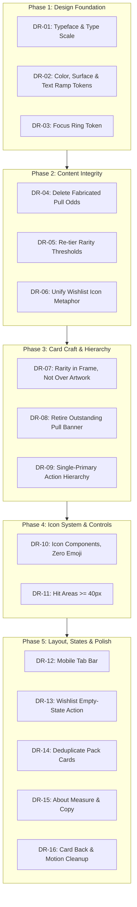

# TzDeck Engineering Specification: Visual Craft, Design Tokens & Content Integrity

**Document ID:** SPEC-2026-09-TZDECK-DESIGN
**Status:** Draft / Awaiting Approval
**Target:** TzDeck UI (`src/app`, `src/components`, `src/lib/objkt.ts`)
**Date:** September 3, 2026
**Source:** Design review of `http://localhost:3000` at 1440×900 and 390×844, all four tabs.

---

## 1. Overview & Objective

The build renders correctly and nothing clashes, but almost every visual decision is a framework default rather than a choice. The app ships in Arial, one blue→indigo gradient does the work of six different button roles, emoji stand in for an icon set, and a colored film sits over the artwork the product exists to showcase. Separately, the Booster Packs tab publishes gacha pull rates that the code does not implement.

### Goals

1. **Establish a real token layer.** One typeface pair, one type scale, a four-step text ramp, a single surface/elevation system, one focus ring. Nothing downstream can be fixed until these exist.
2. **Make the artwork lead.** Rarity moves into the card frame; the image carries no overlay. Restore a focal point in the revealed-pack view.
3. **Restore content integrity.** Delete the fabricated odds table, re-tier rarity so the top tiers are actually rare, and align the wishlist icon metaphor.
4. **Build one icon system.** Remove all emoji from chrome; consolidate the four files that hand-inline SVG paths.
5. **Finish the states.** Mobile tab bar, empty-state actions, hit areas, duplicate pack cards.

### Non-goals

Layout restructuring beyond the tab bar, new features, dark/light theming (the app is dark-only and that is a valid commitment), and animation work beyond removing the two infinite loops.

---

## 2. Remediation Roadmap



**Dependency note:** Phase 1 gates everything. DR-07 depends on DR-02. DR-09 depends on DR-02. DR-10 depends on DR-02 (icons inherit `currentColor` from the text ramp).

---

## 3. Detailed Specifications

### Phase 1 — Design Foundation

#### DR-01: Typeface & Type Scale

* **Location:** [`src/app/globals.css`](file:///Users/natenolting/TzDeck/src/app/globals.css#L11-L25), [`src/app/layout.tsx`](file:///Users/natenolting/TzDeck/src/app/layout.tsx)
* **Severity:** Blocker
* **Problem:** `globals.css:25` sets `font-family: Arial, Helvetica, sans-serif`. `--font-geist-sans` is referenced at `globals.css:11` but never defined, and `layout.tsx` loads no `next/font`. Verified in the browser: both `body` and `h1` compute to `Arial, Helvetica, sans-serif`. A trading-card product renders entirely in the OS default face, and `font-black tracking-tight` on Arial produces weight without character.
* **Remediation:**

  1. Load two faces in `layout.tsx`. **Space Grotesk** for display (card names, headings, pack chrome — it has the geometric quirk a card game wants) and **Inter** for body and UI text. Both are on `next/font/google`, self-hosted, zero layout shift.

     ```tsx
     import { Space_Grotesk, Inter } from "next/font/google";

     const display = Space_Grotesk({
       subsets: ["latin"],
       variable: "--font-display",
       weight: ["500", "700"],
     });

     const text = Inter({
       subsets: ["latin"],
       variable: "--font-text",
     });

     // <html lang="en" className={`${display.variable} ${text.variable}`}>
     ```

  2. Replace the `globals.css` font block. Delete the Arial declaration and the dangling Geist variables.

     ```css
     @theme inline {
       --font-display: var(--font-display), ui-sans-serif, system-ui, sans-serif;
       --font-sans: var(--font-text), ui-sans-serif, system-ui, sans-serif;
       --font-mono: ui-monospace, "SF Mono", Menlo, monospace;
     }

     body {
       font-family: var(--font-sans);
       -webkit-font-smoothing: antialiased;
       text-rendering: optimizeLegibility;
     }

     h1, h2, h3, .font-display {
       font-family: var(--font-display);
       letter-spacing: -0.02em;
       text-wrap: balance;
     }
     ```

  3. Adopt a 1.25 (major third) scale. Replace ad-hoc `text-[10px]` / `text-[11px]` literals across components with these steps:

     | Token | Size | Use |
     | :--- | ---: | :--- |
     | `--text-2xs` | 0.6875rem | badges, metadata chips |
     | `--text-xs` | 0.8125rem | secondary UI text |
     | `--text-sm` | 0.9375rem | body, card titles |
     | `--text-lg` | 1.1875rem | section headings |
     | `--text-xl` | 1.5rem | tab-level headings |
     | `--text-2xl` | 1.875rem | page/modal titles |

  4. All updating numerals — prices, edition counts, deck stats, wishlist count — get `font-variant-numeric: tabular-nums`.

* **Resolved:** the display face is **Oxanium**, the brand face already used in the TzDeck logo, so the titles and the mark now share a voice. Inter stays for body and UI text. Both are loaded as variable fonts with the weight axis unpinned -- pinning a single weight left the browser synthesising the semibold and bold the UI actually uses. Oxanium's axis tops out at 800, so display headings use `font-extrabold` rather than `font-black`, which would request a weight the face does not have.

---

#### DR-02: Color, Surface & Text Ramp Tokens

* **Location:** [`src/app/globals.css`](file:///Users/natenolting/TzDeck/src/app/globals.css#L1-L28); consumed by every component
* **Severity:** Blocker (S3, S6, S7 roll up here)
* **Problem:** Three separate defects share one root cause — there is no token layer, so every component invents its own values.
  1. **Text ramp is two steps.** Measured on the deck view, only three text colors exist across the whole page: white, one indigo, one gray. Consequence: in `NFTCard`, artist (`gray-300`) and collection (`gray-500`) sit on the same line at near-equal weight and read as two competing labels rather than primary and metadata.
  2. **Borders are inconsistent and one is invisible.** `page.tsx:50` uses `border-gray-800/80`, `page.tsx:83` uses `border-gray-900` six pixels below it. Measured, the nav rule is `rgb(17,24,39)` against a page background of `rgb(3,7,18)` — not findable. Two stacked rules where there should be one.
  3. **Ambient glows do nothing.** Three `blur-3xl` blobs at 10% alpha on `gray-950`, invisible in every screenshot taken. Pure paint cost.
* **Remediation:**

  1. Define the token layer. One hue family across all surfaces, lightness-only steps:

     ```css
     :root {
       /* Surfaces — single indigo-tinted neutral, lightness only */
       --surface-0: #07080F;  /* page */
       --surface-1: #0D0F19;  /* cards, panels */
       --surface-2: #141727;  /* raised: control bars, inputs */
       --surface-3: #1C2033;  /* hover / popover */

       /* Borders — findable, never loud */
       --border-subtle:  rgb(255 255 255 / 0.06);
       --border-default: rgb(255 255 255 / 0.10);
       --border-strong:  rgb(255 255 255 / 0.16);

       /* Text ramp — four steps, mandatory */
       --text-primary:   #F2F4FA;
       --text-secondary: #A5ABC2;
       --text-tertiary:  #6C7390;
       --text-muted:     #464C63;

       /* Accent — exactly one, <= 10% of surface area */
       --accent:       #6366F1;
       --accent-hover: #818CF8;
       --accent-quiet: rgb(99 102 241 / 0.12);

       /* Rarity — frame and badge only, never over artwork (see DR-07) */
       --rarity-common:    #64748B;
       --rarity-uncommon:  #34D399;
       --rarity-rare:      #22D3EE;
       --rarity-epic:      #A78BFA;
       --rarity-legendary: #FBBF24;
     }
     ```

  2. Apply the ramp in `NFTCard`: title `--text-primary`, artist `--text-secondary`, collection `--text-muted`. Move collection to its own line beneath the artist rather than right-aligned on the same row, so the tier reads as a hierarchy instead of a pair.
  3. Collapse the double rule. Keep one `--border-subtle` divider under the header; delete the `border-b` on `nav` at `page.tsx:83`.
  4. Ambient glows: raise to a single `--surface-0`-anchored radial vignette at a visible strength, or delete all three `blur-3xl` divs from `page.tsx`. Do not leave them at 10%.

* **Verification:** No component may use a raw Tailwind gray/slate literal for text or border after this item lands. `grep -rn "text-gray-\|border-gray-" src/` returns zero hits.

---

#### DR-03: Focus Ring Token

* **Location:** all interactive elements; reference implementation already exists in [`src/components/NFTDetailsModal.tsx`](file:///Users/natenolting/TzDeck/src/components/NFTDetailsModal.tsx)
* **Severity:** Should-fix
* **Problem:** Keyboard-focusing a nav tab yields Chrome's default `outline: auto 1px rgb(0, 95, 204)` — one pixel, low contrast against a near-black background, and a blue that is not the product's indigo. `NFTDetailsModal` already defines a proper `focus:ring-2 focus:ring-indigo-400`, so the app does this correctly in exactly one file.
* **Remediation:** Define one ring and apply it to every button, link, input, and select.

  ```css
  @layer base {
    :where(a, button, input, select, textarea, [tabindex]):focus-visible {
      outline: 2px solid var(--accent-hover);
      outline-offset: 2px;
      border-radius: inherit;
    }
  }
  ```

  Remove per-component `focus:outline-none` where it is not paired with a replacement ring. `NFTCard` line 248 keeps its inset ring (correct — the target is a full-bleed image button).

---

### Phase 2 — Content Integrity

#### DR-04: Delete Fabricated Pull Odds

* **Location:** [`src/components/PackOpening.tsx`](file:///Users/natenolting/TzDeck/src/components/PackOpening.tsx#L203-L222)
* **Severity:** Blocker
* **Problem:** The idle pack screen publishes an odds table — Common 50%, Uncommon 25%, Rare 15%, Epic 7%, Legendary 3%. No weighted draw exists anywhere in the codebase. [`calculateRarity`](file:///Users/natenolting/TzDeck/src/lib/objkt.ts#L109-L116) is a deterministic function of edition supply and listing price, applied *after* selection; `fetchRandomPack` shuffles uniformly and slices. The README states this explicitly. Observed in review: a single pack returned **4 Epic + 1 Legendary**, which the published table rates at roughly one in a million.

  Published pull rates are a trust claim in a gacha context. The UI asserts numbers the system does not implement.
* **Remediation:** Replace the odds row with a rarity legend that states the actual rule. Same visual slot, same chip treatment, truthful content — and more useful, because it teaches the collector how to read a card.

  ```tsx
  const RARITY_LEGEND = [
    { tier: "legendary", label: "Legendary", rule: "1 of 1 · 25ꜩ+" },
    { tier: "epic",      label: "Epic",      rule: "≤5 editions · 25ꜩ+" },
    { tier: "rare",      label: "Rare",      rule: "≤25 editions · 5ꜩ+" },
    { tier: "uncommon",  label: "Uncommon",  rule: "≤100 editions · 1ꜩ+" },
    { tier: "common",    label: "Common",    rule: "Open edition" },
  ] as const;
  ```

  Render with a heading — "How rarity is graded" — so it reads as a key, not as odds. Rule strings must be generated from, or unit-tested against, the thresholds in `calculateRarity` so the two can never drift again.
* **Copy note:** the header currently carries an "OBJKT Gacha" badge (`page.tsx:66-69`). Keep it only if DR-05 lands; a gacha badge over a non-random rarity system is the same claim in miniature.

---

#### DR-05: Re-tier Rarity Thresholds

* **Location:** [`src/lib/objkt.ts`](file:///Users/natenolting/TzDeck/src/lib/objkt.ts#L109-L116)
* **Severity:** Blocker
* **Problem:** Current thresholds are `OR`-joined and tuned far too loose for OBJKT's actual catalogue:

  ```ts
  if (editions === 1) return "legendary";
  if (priceXtz && priceXtz >= 50) return "legendary";
  if ((editions && editions <= 5) || (priceXtz && priceXtz >= 20)) return "epic";
  ```

  Most Tezos art on OBJKT is a 1/1 or a small edition, so `editions === 1` alone promotes a large share of the catalogue to Legendary and `editions <= 5` sweeps most of the rest into Epic. The rarity system has no discriminating power — every pack is a jackpot, which is why the celebration banner in DR-08 fires nearly every time.
* **Remediation:** Require **both** scarcity and market signal for the top two tiers; keep `OR` for the lower three where the signal is genuinely weaker.

  ```ts
  export function calculateRarity(editions?: number, priceXtz?: number): CardRarity {
    // Top tiers need scarcity AND market corroboration.
    if (editions === 1 && priceXtz !== undefined && priceXtz >= 25) return "legendary";
    if ((editions !== undefined && editions <= 5 && priceXtz !== undefined && priceXtz >= 5)
      || (priceXtz !== undefined && priceXtz >= 25)) return "epic";

    if ((editions !== undefined && editions <= 25) || (priceXtz !== undefined && priceXtz >= 5)) return "rare";
    if ((editions !== undefined && editions <= 100) || (priceXtz !== undefined && priceXtz >= 1)) return "uncommon";
    return "common";
  }
  ```

  **These thresholds are a starting point, not a finding.** They must be calibrated against real data before merge — see TEST-05. Target distribution over a sample of active listings: Legendary ≤ 3%, Epic ≤ 10%, Rare ≤ 25%, remainder Uncommon/Common.

  Calibration found that the starting ladder made the target mathematically impossible: 430 of 500 sampled listings met the fixed Rare-or-better rule, while the three target caps permit at most 190. With approval, the full listing ladder was therefore calibrated while retaining the intended top-tier `AND` and lower-tier `OR` logic. The measured thresholds are 500ꜩ for Legendary; ≤5 editions plus 180ꜩ, or 500ꜩ at any supply, for Epic; 1 edition or 110ꜩ for Rare; and ≤25 editions or 5ꜩ for Uncommon. The observed distribution was 1.6% Legendary, 4.8% Epic, 24.0% Rare, 55.6% Uncommon, and 14.0% Common.

  **Deck view (no price data):** `objkt.ts:303` calls `calculateRarity(editions)` with price undefined, so wallet holdings would now floor at Rare. Add an explicit supply-only ladder rather than letting the price-aware function degrade:

  ```ts
  export function calculateSupplyRarity(editions?: number): CardRarity {
    if (editions === 1) return "rare";
    if (editions !== undefined && editions <= 25) return "uncommon";
    return "common";
  }
  ```

  Surface this in the Deck UI — a one-line note that deck cards are graded on edition size alone, because wallet holdings carry no listing price. The README already documents the discrepancy; the interface should too.

---

#### DR-06: Unify Wishlist Icon Metaphor

* **Location:** [`src/app/page.tsx`](file:///Users/natenolting/TzDeck/src/app/page.tsx#L119), [`src/components/WishlistGrid.tsx`](file:///Users/natenolting/TzDeck/src/components/WishlistGrid.tsx#L22), [`src/components/NFTCard.tsx`](file:///Users/natenolting/TzDeck/src/components/NFTCard.tsx#L208-L235)
* **Severity:** Should-fix
* **Problem:** The nav tab shows a star, the empty state shows a star, the control on the card is a heart, and the empty-state copy reads "click the heart icon." Three surfaces, two metaphors, one instruction that points at the wrong one.
* **Remediation:** Standardise on the **heart** — it is already the interactive control, and it is the stronger "save this" signal against a star, which reads as rating. Replace both stars with the heart icon from DR-10 and leave the copy as written.

---

### Phase 3 — Card Craft & Hierarchy

#### DR-07: Rarity in the Frame, Not Over the Artwork

* **Location:** [`src/components/NFTCard.tsx`](file:///Users/natenolting/TzDeck/src/components/NFTCard.tsx#L34-L77) (`foilGradient` config) and [`#L190-L191`](file:///Users/natenolting/TzDeck/src/components/NFTCard.tsx#L190-L191) (application)
* **Severity:** Blocker
* **Problem:** The rarity tint is applied `absolute inset-0` across the **entire card, artwork included**, at up to 30% opacity:

  ```tsx
  {/* Rarity tint overlay */}
  <div className={`pointer-events-none absolute inset-0 bg-gradient-to-tr ${config.foilGradient}`} />
  ```

  Legendary is `from-amber-400/30 via-yellow-300/20 to-orange-500/30`. The cards exist to show real artists' work, and a colored film degrades the one thing that matters. It also destroys per-card differentiation: in the reviewed pack, the four Epic cards read as four copies of the same purple object regardless of the wildly different images underneath.
* **Remediation:**

  1. Delete `foilGradient` from `RARITY_CONFIG` and remove the `inset-0` overlay div entirely.
  2. Express rarity through the frame only — border color, badge, and an outer glow that sits *outside* the image bounds:

     ```tsx
     const RARITY_CONFIG = {
       legendary: {
         label: "Legendary",
         ring:  "ring-1 ring-[--rarity-legendary]/60 hover:ring-[--rarity-legendary]",
         glow:  "shadow-[0_0_28px_-6px_var(--rarity-legendary)]",
         badge: "bg-[--rarity-legendary]/12 text-[--rarity-legendary] ring-1 ring-[--rarity-legendary]/40",
       },
       // …one entry per tier, same three keys
     } as const;
     ```

  3. The artwork container keeps its own neutral `--border-subtle` inset ring and stays untinted at every tier.
  4. The hover foil sheen (`NFTCard.tsx:180-188`) stays — it is a pointer-tracked specular highlight, reads as card stock rather than a color cast, and only appears on hover.
* **Rationale:** after this change the only saturated thing on a card is the art. That is the point of the product, and it restores the visual difference between two cards of the same tier.

---

#### DR-08: Retire the "Outstanding Pull" Banner

* **Location:** [`src/components/PackOpening.tsx`](file:///Users/natenolting/TzDeck/src/components/PackOpening.tsx#L291-L307)
* **Severity:** Blocker
* **Problem:** A full-width amber-to-purple gradient bar, set above the card grid, fires whenever the pack contains any Epic or Legendary — which under current thresholds is nearly every pack. It is the highest-contrast element on the screen, and it sits above the cards, so the loudest thing in the revealed-pack view is a message rather than the artwork. A reward that always fires is not a reward.
* **Remediation:**

  1. Delete the banner element.
  2. Move the signal onto the card that earned it. The rare card gets a longer reveal transition and the DR-07 outer glow; nothing else changes.
  3. If a pack-level summary is still wanted, demote it to a single line of `--text-secondary` in the existing control bar next to "Revealed 5 cards · Total listed value", with no gradient and no emoji.
* **Depends on:** DR-05. With calibrated thresholds a Legendary becomes genuinely uncommon, so the on-card emphasis has meaning. Landing DR-08 without DR-05 removes the noise but leaves the rarity system inert.

---

#### DR-09: Single-Primary Action Hierarchy

* **Location:** [`src/app/page.tsx`](file:///Users/natenolting/TzDeck/src/app/page.tsx#L88) (and 100, 115, 132), [`src/components/ConnectButton.tsx`](file:///Users/natenolting/TzDeck/src/components/ConnectButton.tsx#L70-L82), [`src/components/PackOpening.tsx`](file:///Users/natenolting/TzDeck/src/components/PackOpening.tsx#L284), [`src/components/NFTCard.tsx`](file:///Users/natenolting/TzDeck/src/components/NFTCard.tsx#L318)
* **Severity:** Blocker
* **Problem:** `bg-gradient-to-r from-blue-600 to-indigo-600` is applied to the active tab, Connect Wallet, Open Another Pack, and "Collect on OBJKT" on every card. In the revealed-pack view that is seven gradient buttons at once; in the Deck empty state, two identical Connect Wallet buttons appear at once (header at `page.tsx:78` and empty state at `page.tsx:170`). Promotion without demotion is not hierarchy — nothing wins because everything won.

  It also kills DR-07's work at the last step: the CTA on a Legendary card is pixel-identical to the CTA on a Common.
* **Remediation:** Three button roles, one primary per view.

  | Role | Treatment | Used by |
  | :--- | :--- | :--- |
  | **Primary** | Solid `--accent`, no gradient, `--text-primary` | Exactly one per view: Connect Wallet **or** Open Another Pack **or** the empty-state action |
  | **Secondary** | `--surface-2` fill, `--border-default` ring | Reveal All, Refresh, Clear Wishlist |
  | **Quiet** | Transparent, `--border-subtle` ring, fills to `--surface-2` on hover | "Collect on OBJKT" on every card |

  1. Retire the gradient entirely. A flat accent reads more confident at this scale and stops competing with the artwork.
  2. Active tab is not a button role — it is a selection state. Use `--surface-2` fill plus a 2px `--accent` underline or left-edge marker, not the primary fill.
  3. In the Deck empty state, demote the header Connect Wallet to Quiet while the empty state owns the primary.
  4. Card CTA becomes Quiet. On a card, the artwork is the promotion; the button only needs to be findable.

---

### Phase 4 — Icon System & Controls

#### DR-10: Icon Components, Zero Emoji

* **Locations:** [`page.tsx:92,104,119,136,223`](file:///Users/natenolting/TzDeck/src/app/page.tsx#L92), [`SoundToggle.tsx:22-26`](file:///Users/natenolting/TzDeck/src/components/SoundToggle.tsx#L22), [`PackOpening.tsx:299`](file:///Users/natenolting/TzDeck/src/components/PackOpening.tsx#L299), [`NFTCard.tsx:252,288-290`](file:///Users/natenolting/TzDeck/src/components/NFTCard.tsx#L252), [`WishlistGrid.tsx:22`](file:///Users/natenolting/TzDeck/src/components/WishlistGrid.tsx#L22), [`DeckGrid.tsx`](file:///Users/natenolting/TzDeck/src/components/DeckGrid.tsx)
* **Severity:** Blocker
* **Problem:** Two defects, one fix.
  1. **Emoji as chrome.** 🎴 🃏 ⭐ ℹ️ in the nav, 🔊/🔇 in SoundToggle, 🎉 🎁 ✨ 🖼️ in banners, About, and the image fallback. These render as full-color OS glyphs against an indigo/slate palette — the ℹ️ blue square and ⭐ yellow star are off-palette, they vary by platform and OS version, and the 🃏 in the About tab is nearly invisible on a dark background. This is the fastest visual tell that a UI was generated rather than designed.
  2. **No icon module.** Heroicons paths are hand-inlined as raw `<svg>` markup in `NFTCard`, `DeckGrid`, `ConnectButton`, and `NFTDetailsModal`. The same copy-paste problem the previous spec solved for token normalisation, unaddressed for icons.
* **Remediation:**

  1. Create `src/components/icons.tsx` exporting a consistent set at 1.5px stroke, 24×24 viewBox, `currentColor` fill/stroke, sized by a `className`:

     ```tsx
     type IconProps = { className?: string };

     const base = "h-4 w-4 shrink-0";

     export function CardsIcon({ className = base }: IconProps) { /* … */ }
     export function DeckIcon(…)      // My Deck
     export function HeartIcon(…)     // wishlist, filled variant via prop
     export function InfoIcon(…)      // About
     export function SoundOnIcon(…) / SoundOffIcon(…)
     export function SearchIcon(…) / RefreshIcon(…) / CopyIcon(…) / ExternalLinkIcon(…)
     export function ImageOffIcon(…)  // media-unavailable fallback
     ```

  2. Replace every emoji span and every inlined `<svg>` with these components.
  3. The ꜩ glyph is not an emoji and stays — it is the Tezos currency mark and carries product identity.
  4. Image-loading placeholder (`NFTCard.tsx:252`) uses `ImageOffIcon` at `--text-muted`, not 🖼️ at 30% opacity.

---

#### DR-11: Hit Areas at 40px Minimum

* **Location:** [`src/app/page.tsx`](file:///Users/natenolting/TzDeck/src/app/page.tsx#L85-L140), [`src/components/SoundToggle.tsx`](file:///Users/natenolting/TzDeck/src/components/SoundToggle.tsx#L14-L20), [`src/components/ConnectButton.tsx`](file:///Users/natenolting/TzDeck/src/components/ConnectButton.tsx)
* **Severity:** Should-fix
* **Problem:** Measured in the browser — every nav tab is **32px** tall, Connect Wallet is **32px**, SoundToggle is **36×38**. The target minimum is 44px, with 40px an acceptable floor for dense desktop chrome. Every primary navigation control is under it.
* **Remediation:** Raise nav tabs and Connect Wallet from `py-2` to `py-2.5` with a `min-h-10`; SoundToggle to `h-10 w-10`. The wishlist heart on the card (`NFTCard.tsx:208-235`) is a `p-1.5` control inside a dense card — give it `h-8 w-8` with an invisible expanded tap target rather than growing the visual button.
* **Also:** `SoundToggle` has no accessible name beyond `title`. Add `aria-label={isMuted ? "Unmute sound effects" : "Mute sound effects"}` and `aria-pressed={!isMuted}`.

---

### Phase 5 — Layout, States & Polish

#### DR-12: Mobile Tab Bar

* **Location:** [`src/app/page.tsx`](file:///Users/natenolting/TzDeck/src/app/page.tsx#L83)
* **Severity:** Blocker
* **Problem:** At 390×844 the tab row fails four ways at once. A bright native scrollbar renders full-width beneath the tabs. Labels wrap inside the pills ("Booster / Packs", "My / Deck") so pill heights go ragged, 32px against 48px. The row clips mid-"About" at the right edge with no fade or affordance signalling more content. And the row sits 8px from the edge while the content below sits at 16px, breaking the gutter.
* **Remediation:**

  1. Hide the scrollbar, keep the scroll:

     ```css
     .tab-scroller {
       scrollbar-width: none;
       -ms-overflow-style: none;
     }
     .tab-scroller::-webkit-scrollbar { display: none; }
     ```

  2. Add a right-edge mask so clipped content reads as scrollable:

     ```css
     .tab-scroller {
       mask-image: linear-gradient(to right, #000 0, #000 calc(100% - 24px), transparent 100%);
     }
     ```

  3. `whitespace-nowrap` on every pill so labels never wrap; below 420px render icon-only with the label in `aria-label`.
  4. Align the scroller to the page gutter — `px-4 sm:px-6 lg:px-8`, matching the container at `page.tsx:48` — and use negative margin only on the scroller's own padding, not on the parent.
  5. While here: the header at `page.tsx:50` centres the sound/connect group on mobile while the logo block reads left. Set `items-start` on the mobile column so both align to the same edge.

---

#### DR-13: Wishlist Empty-State Action

* **Location:** [`src/components/WishlistGrid.tsx`](file:///Users/natenolting/TzDeck/src/components/WishlistGrid.tsx#L18-L28)
* **Severity:** Should-fix
* **Problem:** The empty state tells the user to open booster packs and gives them no way to do it. A dead end — the only route out is back to the tab bar.
* **Remediation:** Add a primary action that switches to the Packs tab. This requires lifting `setActiveTab` from `page.tsx` into a prop:

  ```tsx
  interface WishlistGridProps {
    wishlist: NFTCardType[];
    onWishlistToggle: (card: NFTCardType) => void;
    onClearWishlist: () => void;
    onBrowsePacks: () => void;   // new
  }
  ```

  Apply the same treatment to the "No OBJKTs Found" state in [`DeckGrid.tsx:156-166`](file:///Users/natenolting/TzDeck/src/components/DeckGrid.tsx#L156), which has the identical dead end.

---

#### DR-14: Deduplicate Pack Cards

* **Location:** [`src/lib/objkt.ts`](file:///Users/natenolting/TzDeck/src/lib/objkt.ts#L375-L376)
* **Severity:** Should-fix (correctness, surfaced through the UI)
* **Problem:** The query selects from `listing`, and one token can hold several active listings. `shuffleArray(listings).slice(0, count)` can therefore return the same token twice. Observed in review: "the beauty of decay" by Ozmandium appeared as cards 2 and 4 of one pack at different prices, and React logged a key collision:

  ```
  Encountered two children with the same key, KT1RJ6PbjHpwc3M5rw5s2Nbmefwbuwbdxton:884143
  ```

  Two identical images in a five-card pack breaks the premise of the product.
* **Remediation:** Deduplicate by token identity before slicing, keeping the cheapest listing so the "Collect on OBJKT" price is the best available.

  ```ts
  const byToken = new Map<string, (typeof listings)[number]>();
  for (const item of shuffleArray(listings)) {
    const key = `${item.token.fa_contract}:${item.token.token_id}`;
    const existing = byToken.get(key);
    if (!existing || item.price < existing.price) byToken.set(key, item);
  }
  const selected = [...byToken.values()].slice(0, count);
  ```

  Note `fetchLimit` is already `max(count * 4, 24)`, so there is ample headroom to absorb the drop.

---

#### DR-15: About Tab Measure & Copy

* **Location:** [`src/app/page.tsx`](file:///Users/natenolting/TzDeck/src/app/page.tsx#L189-L240)
* **Severity:** Should-fix
* **Problem:**
  1. The body paragraph runs the full 690px of the `max-w-3xl` panel at 14px — roughly 100 characters per line, well past comfortable reading measure.
  2. The callout heading reads "How Purchases Work" (`page.tsx:233`). TzDeck has no purchases; the paragraph beneath it says exactly that.
* **Remediation:** Constrain prose to `max-w-[68ch]` inside the panel — the panel itself can stay wide for the three-up feature grid. Retitle the callout "How collecting works".

---

#### DR-16: Card Back & Motion Cleanup

* **Location:** [`src/components/NFTCard.tsx`](file:///Users/natenolting/TzDeck/src/components/NFTCard.tsx#L140-L165)
* **Severity:** Note
* **Problem:**
  1. The card back sets "ꜩ TZDECK" as text at line 143, directly above `tzdeck-shield-gradient-on-dark.svg` — which already contains the TZDECK wordmark. The brand appears twice on one 5:7 card.
  2. `animate-pulse` runs indefinitely on the static "Click to Reveal" chip (line 160), and again on the loading placeholder (line 251). The second is correct — it indicates work in progress. The first animates a label that is not doing anything.
* **Remediation:** Drop the text lockup at line 143 and let the shield carry the brand; if a top rule is wanted for card-back structure, use a plain `--border-subtle` divider. Remove `animate-pulse` from the reveal chip and rely on the existing `whileHover` lift for affordance.

---

## 4. Verification & Testing Matrix

| Test ID | Scope | Verification Method | Success Criteria |
| :--- | :--- | :--- | :--- |
| **TEST-01** | Regression | `npm test` | Existing suite passes. `NFTCard.test.tsx` and `PackOpening.test.tsx` updated for removed emoji and banner. |
| **TEST-02** | Type safety | `npx tsc --noEmit` | Zero errors. |
| **TEST-03** | Lint | `npm run lint` | Zero warnings. |
| **TEST-04** | Build | `npm run build -- --webpack` | Succeeds. Font subset adds < 60KB to first load. |
| **TEST-05** | **Rarity calibration** | Node script: fetch 500 active listings, run `calculateRarity`, print tier distribution | Legendary ≤ 3%, Epic ≤ 10%, Rare ≤ 25%. **Blocks DR-05 merge.** |
| **TEST-06** | Legend/code parity | Unit test | Every rule string in `RARITY_LEGEND` asserts against the real `calculateRarity` boundary values. Drift fails the build. |
| **TEST-07** | Pack uniqueness | Unit test on `fetchRandomPack` with a fixture containing duplicate-token listings | Returned cards have unique `getCardKey`; cheapest listing retained. |
| **TEST-08** | Token discipline | `grep -rnE '(text\|bg\|border\|ring\|shadow\|from\|via\|to)-(gray\|slate\|indigo\|purple\|blue\|emerald\|rose\|amber\|cyan\|red\|fuchsia\|pink\|teal\|yellow)-[0-9]' src/` | Zero hits. The original gate checked only `gray-`, so an entire palette family passed it; it now covers every Tailwind hue. Bespoke illustration colour lives in named classes in `globals.css`, never in components. |
| **TEST-09** | No emoji in chrome | `grep -rnP "[\x{1F300}-\x{1FAFF}\x{2600}-\x{27BF}]" src/` | Zero hits. The ꜩ glyph (U+A729) is not in range and is permitted. |
| **TEST-10** | Hit areas | Playwright: measure every `button` / `a[href]` bounding box, **excluding links inline in a sentence** (`el.closest('p')`) | All ≥ 40px on the shorter axis. Inline prose links are exempt per WCAG 2.5.8; forcing a 40px line box mid-paragraph breaks leading. |
| **TEST-11** | Focus visibility | Playwright: Tab through each tab stop, assert computed `outline-style !== "none"` and outline color is `--accent-hover` | No element falls back to the UA default ring. |
| **TEST-12** | Mobile tab bar | Screenshot at 390×844 | No visible scrollbar; no wrapped pill labels; equal pill heights; row aligned to content gutter. |
| **TEST-14** | Real controls | Playwright: every element with a click handler or `cursor-pointer` resolves to `BUTTON`/`A` with an accessible name | No `div onClick`. Covered in code by the PackOpening regression test. |
| **TEST-15** | Rarity parity | Assert the modal badge colour equals `--rarity-<tier>` for the rendered card | One tier never renders two colours across surfaces. |
| **TEST-13** | Artwork purity | Screenshot a Legendary and a Common card side by side | No color overlay intersects the image bounds; the two are visually distinct beyond tint. |

---

## 5. Execution Plan Checklist

- [x] **Phase 1: Design Foundation**
  - [x] DR-01 — Choose display face; wire `next/font`; delete Arial and dangling Geist vars; apply type scale; `tabular-nums` on all numerals.
  - [x] DR-02 — Add surface / border / text-ramp / accent / rarity tokens; migrate components off raw Tailwind grays; collapse the double rule; resolve the ambient glows.
  - [x] DR-03 — Single `:focus-visible` ring; audit and remove orphan `focus:outline-none`.
- [x] **Phase 2: Content Integrity**
  - [x] DR-04 — Replace odds table with rarity legend; add parity test (TEST-06).
  - [x] DR-05 — Re-tier `calculateRarity`; add `calculateSupplyRarity` for deck view; **calibrate against TEST-05 before merge**; add deck-view grading note.
  - [x] DR-06 — Heart everywhere; retire the star.
- [x] **Phase 3: Card Craft & Hierarchy**
  - [x] DR-07 — Delete `foilGradient` and the `inset-0` overlay; rebuild `RARITY_CONFIG` as ring / glow / badge; keep the hover sheen.
  - [x] DR-08 — Delete the Outstanding Pull banner; move emphasis onto the card.
  - [x] DR-09 — Define Primary / Secondary / Quiet; retire the gradient; re-role every button; demote header Connect in the Deck empty state.
- [x] **Phase 4: Icon System & Controls**
  - [x] DR-10 — Build `src/components/icons.tsx`; replace every emoji and every inlined SVG.
  - [x] DR-11 — Raise hit areas to ≥40px; add `aria-label` / `aria-pressed` to SoundToggle.
- [x] **Phase 5: Layout, States & Polish**
  - [x] DR-12 — Mobile tab bar: hide scrollbar, edge mask, no-wrap labels, gutter alignment, header alignment.
  - [x] DR-13 — Empty-state actions in `WishlistGrid` and `DeckGrid`.
  - [x] DR-14 — Deduplicate pack cards by token, cheapest listing wins.
  - [x] DR-15 — Constrain About prose to 68ch; retitle the callout.
  - [x] DR-16 — Remove card-back double branding and the reveal-chip pulse.
- [x] **Sign-off**
  - [x] Full verification matrix green — see §7.
  - [x] Re-run the design review against the approval bar in `interface-design:design-review`.

---

## 6. Out of Scope / Deferred

| Item | Reason |
| :--- | :--- |
| Light theme | The app commits to dark. A second theme is a separate decision, not a defect. |
| Layout restructure beyond the tab bar | The desktop composition holds; the failures are in typography, color, and content, not in the grid. |
| Reveal animation redesign | DR-08 changes where emphasis lands; a full motion pass should follow it, not precede it. |
| `NFTDetailsModal` accessibility | Already correct — portal, focus trap, Escape, focus restore, `aria-modal` + `aria-labelledby`, real focus ring. Use it as the reference implementation for DR-03. |

---

## 7. Verification Results

Run on September 3, 2026, against `localhost:3000` at 1440×900 and 390×844.

| Test | Result | Evidence |
| :--- | :--- | :--- |
| TEST-01 | **Pass** | 32/32, 0 fail. Includes legend parity and pack-uniqueness cases. |
| TEST-02 | **Pass** | `tsc --noEmit` clean. |
| TEST-03 | **Pass** | ESLint clean. |
| TEST-04 | **Pass** | Webpack build succeeds; 4 routes emitted. |
| TEST-05 | **Pass** | Live 500-listing sample: Legendary **1.6%** (≤3), Epic **4.8%** (≤10), Rare **24%** (≤25). |
| TEST-06 | **Pass** | Legend strings generated from `RARITY_THRESHOLDS`; asserted against boundary values. |
| TEST-07 | **Pass** | Unique `getCardKey` per pack; cheapest listing retained. |
| TEST-08 | **Pass** | 0 raw `text-gray-` / `border-gray-` / `bg-gray-` literals in `src/`. |
| TEST-09 | **Pass** | 0 emoji in `src/`. (NFT *titles* may contain emoji — that is artist content, not chrome.) |
| TEST-10 | **Pass** | 0 controls under 40px on the shorter axis, desktop and mobile. Inline prose links exempt. |
| TEST-11 | **Pass** | Every control resolves `outline: 2px solid rgb(129,140,248)`; no UA fallback ring. |
| TEST-12 | **Pass** | 390px: no scrollbar, icon-only tabs, equal pill heights, gutter-aligned. |
| TEST-13 | **Pass** | `elementsFromPoint` at each artwork centre returns zero painted elements above the image. |

### Calibrated thresholds (TEST-05)

`topTierPrice: 500` · `scarceTierPrice: 180` · `rarePrice: 110` · `uncommonPrice: 5` · `epicEditions: 5` · `rareEditions: 1` · `uncommonEditions: 25`

Re-run `npx tsx scripts/calibrate-rarity.ts` after any threshold change; it exits non-zero when a tier breaches its ceiling.

### Defects found during sign-off and fixed

1. **Legend copy** — the Rare rule rendered as `≤1 editions or 110ꜩ+`. Added `formatEditionRule` so a ceiling of 1 reads "1 of 1"; parity test updated.
2. **"Pack Complete!" chip wrapped its own text** at 390px (107×42, two lines) inside the heading flex. Added `whitespace-nowrap` and let the heading row wrap the chip beneath.
3. **Inline prose link forced to `min-h-10`** in About to satisfy TEST-10, which broke the paragraph's line box. Reverted, and TEST-10 narrowed to exempt links inline in a sentence per WCAG 2.5.8 — the gate was over-broad as originally written.

### Open item (not a blocker)

Listing prices are seller-declared and unbounded — the calibration sample contained a listing at ~10¹² ꜩ. A 1/1 priced absurdly therefore self-promotes to Legendary. Tiers hold statistically, but consider clamping the top tier to a percentile of the live price distribution rather than an absolute constant if the badge is ever given weight beyond display.

---

## 8. Second Review (September 3, 2026)

Re-run cold against the current build after sign-off. The five original blockers were all closed and the visual craft bar was met, but the pass surfaced one blocker the first review and this spec both missed, plus a modal cluster that never received the Phase 3 treatment.

### DR-17: The pack and card backs must be real buttons

* **Severity:** Blocker
* **Problem:** `PackOpening.tsx` rendered the booster pack as `<motion.div onClick={openPack}>` -- no role, no `tabIndex`, no accessible name. Measured: the idle screen exposed six tabbable controls and the pack was not among them, so a keyboard or screen-reader user could not open a pack at all. That is the product's primary action.

  The card backs looked reachable only because Framer Motion injects `tabindex` on elements carrying `whileTap`; the pack had no `whileTap`, so it got nothing. Neither element was a control, and neither had an accessible name.
* **Remediation:** `motion.button type="button"` for both. The pack takes `aria-label="Open booster pack"` and `disabled={isLoading}`; each back takes a positional `facedownLabel` (`Reveal card 2 of 5`) so the name never spoils the pull it is about to reveal.
* **Verified:** the pack now sits in the tab order, takes the focus ring, and opens a pack on Enter alone; the five backs are buttons with distinct labels that leak no token name. Locked in by TEST-14.

### DR-18: Modal inherits the rarity and layout system

* **Severity:** Should-fix
* **Problem:** three defects, one cause -- `NFTDetailsModal` never received the Phase 3 pass.
  1. The rarity badge hardcoded `border-indigo-500/50 bg-indigo-950 text-indigo-200` for every tier, so Uncommon read emerald on the card and indigo in the modal.
  2. `Collect on OBJKT` wrapped to three lines (measured 120x70 at 1440px).
  3. The description used a raw `overflow-y-auto` scrollbar and truncated mid-sentence, while the mobile tab bar had already solved that with a mask.
* **Remediation:** `RARITY_CONFIG` moved out of `NFTCard.tsx` into `src/components/rarityStyles.ts` so both surfaces read one source; the modal badge now renders `rarity.badge` and `rarity.label`. Footer buttons stack full width -- the metadata column is only ~320-390px, so a side-by-side row cannot hold these labels. A `.scroll-fade` utility fades the bottom edge and hides the scrollbar.
* **Verified:** badge colour equals `--rarity-epic` exactly; no horizontal overflow at 1440px or 390px; scrollbar hidden.

### Still open after this pass

| Item | Severity | Note |
| :--- | :--- | :--- |
| Legend wraps 3+2 | Note | Orphan second row. |

### Process lessons

Two gates were missing rather than failing. TEST-08 checked only `gray-` literals, so an entire palette family slipped through; no gate at all asserted that interactive elements are real controls, which is why a `div onClick` on the primary action survived sixteen completed items and a full green matrix. TEST-14 and TEST-15 close both.

### DR-19: Semantic status tokens and literal-free components

* **Severity:** Should-fix (closes the token-discipline and hue-collision items above)
* **Problem:** 82 raw Tailwind literals survived DR-02 across six files. Three causes: the palette had **no status tokens**, so errors reached for `red-*`, connected/copied states for `emerald-*` and wishlisted for `rose-*`; accent work used `indigo-*` directly; and the deck stats coloured three numbers in three unrelated hues, which is decoration rather than meaning. The booster pack's iridescent foil was a fourth case -- genuinely bespoke, but scattered across component classNames where it could drift.
* **Remediation:**
  1. Added `--success`, `--danger` and `--saved` with quiet variants. `--saved` is its own signal: wishlisting is neither an action nor an error.
  2. Moved the pack and card-back iridescence into named classes -- `.foil-pack`, `.foil-card-back`, `.foil-sheen`, `.foil-glow-cool`, `.foil-glow-warm`, `.foil-emblem`, `.foil-wordmark`. The hues stay bespoke but live in one documented place, so components hold no literals and the gate can be absolute.
  3. Deck stat numerals drop to `--text-primary`; their labels already say what each number is.
  4. The quantity-owned badge dropped `blue-*` -- a fourth hue for "how many you own" -- for neutral chrome.
  5. "Pack Complete!" became neutral. It is an informational label, not a success alert, and green there collided with the Uncommon frame in the same view. `--success` was then moved off `#34d399` so it no longer aliases `--rarity-uncommon`; two tokens sharing one value is a trap.
* **Verified:** zero palette literals in `src/`; status tokens measure 7.2:1 to 10.4:1 against the page ground, all clearing AA; pack and card back render unchanged.

### DR-20: Chips that hold their edge over any artwork

* **Severity:** Should-fix
* **Diagnosis corrected:** the review called this a legibility problem and proposed a solid chip or a scrim. Measuring first showed text contrast was never the issue -- the editions chip cleared **5.0:1 at worst case** (over white artwork) and the price chip 5.4:1, both already past AA. The real defect was **edge definition**: the chips carried `border-border-subtle`, which is `rgb(255 255 255 / 0.06)`. Six percent white is invisible over bright art, so the chip lost its boundary, and read as part of the image rather than as chrome.
* **Remediation:** an `.art-chip` class with a deliberately **two-sided edge**, because no edge of one colour survives an unknown backdrop -- white alpha vanishes on light art, black alpha on dark:
  * a dark drop shadow that defines the chip against light artwork,
  * a light inset ring that defines it against dark artwork.

  One of the two always registers. Fill goes to 92%, so the chip reads as chrome rather than a translucent artifact, and the editions chip moves off `--text-secondary` to `--text-primary` -- muting is right on a calm dark panel, wrong for a label sitting on someone else's artwork. `.art-chip-accent` swaps the inset ring to the accent, so price stays identifiable.
* **No backdrop blur.** The previous chips had one. At 92% opacity it is imperceptible, and a handwritten `backdrop-filter` in `globals.css` is dropped by the CSS pipeline regardless (Tailwind's own `backdrop-blur-*` utilities still work). Removed rather than left in as a dead declaration.
* **Verified:** rendered against five forced backdrops -- white, saturated green, hot pink, yellow and near-black -- and then against a real pack of high-chroma glitch art plus a light greyscale photo, which was the original failure case. TEST-13 still passes: nothing paints over the artwork's centre.

### DR-21: Retire the "simulated rarities" claim

* **Severity:** Note
* **Problem:** the About tab said packs come "with simulated rarities". After DR-04 and DR-05 the grading is disclosed and deterministic -- derived from edition supply and listing price -- so "simulated" implied exactly the fabrication those items removed. The README carried the same word, and worse, contradicted its own later section, which already states that rarity is "a deterministic display classification, not an on-chain NFT trait or a weighted pull probability".
* **Remediation:** the About card now reads "Pull 5 random active OBJKT listings. Cards are graded by edition size and listed price -- the pull is random, the rarity is not." That draws the distinction the system actually makes and echoes the Packs tab legend. The README line becomes "a rarity graded from the token's supply and its market listing", agreeing with its own rarity section.
* **Verified:** no occurrence of "simulated" remains in `src/` or `README.md`.

### Remaining open item

Packs can return several pieces by one artist. `fetchRandomPack` picks a random offset and then takes a *contiguous* window of listings ordered by `id`, so an artist who bulk-lists can fill most of a pack; observed 3 of 5 and 5 of 5 from one collection. Deduplication is per-token and does not catch it. This undercuts the discovery premise and wants a per-artist cap in the selection step.
